**기능 정의서:** 프로젝트 정의서의 사용자 스토리를 기반으로 세부 기능을 구체적으로 정의합니다.

---

### **🖥️ 페이지**

1. **사장님**
    - 소셜 로그인/회원가입
        - 소셜 로그인 (카카오) 버튼
    - 주문서 제작(생성)
        - 커스텀 가능
            - 텍스트, 체크박스, 라디오 버튼, 이미지 등 자유롭게 제작
            - 보관법/가격/재고 안내 등 추가 기입
    - 마이페이지
        - 사업자 정보 수정 버튼
        - 내가 등록한 업장 정보 수정 버튼
    - 메인 페이지
        - 사업자 등록 버튼
        - 사장님이 등록한 업장의 링크 확인/복사
        - 사장님이 생성한 주문서 리스트
        - 예약 현황 확인
            - 대기/확정
    - 예약 페이지
        - (기본) 리스트
            - `주문서 바로가기`
            - 필터링 (주문서/대기/확정)
            - 대기 → 확정 버튼
        - (추가) 달력
            - 확정된 주문서만 표시
            - `주문서 바로가기`
    
2. **고객**
    1. 전체 업종 탐색 페이지
        1. 필터링 기능 (지역, 업종)
        2. 검색 기능 (업장명)
    2. 주문서 작성
        1. 이름, 연락처 필수 기입 
        2. 커스텀 항목에 대한 답변 기입
        3. 예약금 입금 
    3. 주문에 대한 대기/확정/취소 및 알림 
        1. `주문서 상세보기`를 통해 입력한 주문서, 주문 현황 확인 및 취소 가능

---

### 로그인/회원가입 사용자 스토리

---

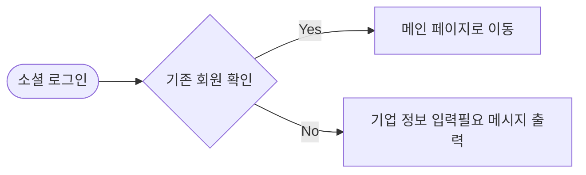

**기능**

1. **소셜 로그인 기능**
    - `사업자`는 서비스를 이용하기 위해 간편 소셜 로그인을 통해 서비스 가입/이용할 수 있다.

**사용자 액션**

1. **소셜 로그인 버튼 클릭**
    - `기존 사업자`는 메인 페이지로 이동
    - `신규 사업자`는 사업장 정보를 입력할 수 있는 MY 페이지로 이동

---

### 메인 페이지 사용자 스토리

---

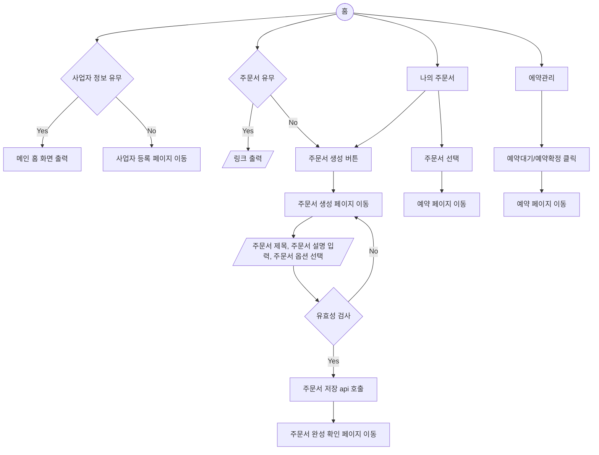

**기능**

1. 나의 폼
    - `사업자`가 생성한 주문서 폼이 존재한다면 업장페이지 이동 링크 출력
    - `사업자`가 생성한 주문서 폼이 존재하지 않으면 주문서 생성 버튼 출력, “주문서를 생성해주세요!”메시지 출력
2. 나의 주문서
    - `사업자`는 새로운 주문서를 추가 페이지로 이동 후 주문서를 추가할 수 있다.
    - `사업자`는 생성된 주문서 폼 리스트를 확인 할 수 있다.
3. 예약관리
    - `사업자`는 예약 대기 총 수를 파악할 수 있다.
    - `사업자`는 예약 확정 전체/일일 예약 확정 수를 파악할 수 있다.

**사용자 액션**

1. 나의 폼
    - 주문서 폼이 생성되어 있다면 나의 폼에서 링크 표시.
        - 링크를 복사하여 이용할 수 있음
    - 주문서 폼이 생성되어 있지 않다면 링크 표시 되지 않음
        - "주문서를 먼저 생성해 주세요!" 메시지 출력
2. 나의 주문서
    - 주문서 생성 버튼 클릭
        - 주문서 폼 생성 페이지로 이동
    - 주문서 클릭
        - 예약 페이지로 이동 후 관련 주문서 리스트 출력
3. 예약관리
    - 예약대기/예약확정 클릭
        - 예약 페이지로 이동
            - 대기/예약확정 순서로된 리스트 출력

---

### 주문서 생성 사용자 스토리

---

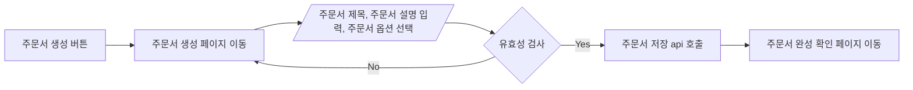

**기능**

1. 주문서 생성
    - `사업자`는 주문서 생성 버튼으로 새로운 주문서를 추가할 수 있다.

**주문서 입력 항목**

- 주문서 제목: 문자열 (최대 50자)
- 주문서 설명: 문자열 (최대 255자)

**주문서 제작 페이지 제공 옵션**

- text: 단답형의 짧은 답할 수 있음
- textarea: 장문형의 긴 답할 수 있음
- radio: 보기 옵션 중 한 가지 옵션만 답할 수 있음
- checkbox: 보기 옵션의 복수 선택을 할 수 있음, 최대 선택 수와 최소 선택 수를 설정할 수 있음
- formData: 원하는 도안의 파일을 받을 수 있음 (용량: 2Mb, jpg/jpeg,png로 제한)
- date: 날짜와 시간을 선택할 수 있음

**사용자 액션**

1. 주문서 생성 버튼 클릭
    - 제작 완료
        - 제작 완성 확인 페이지로 이동

---

### **예약 관리 사용자 스토리**

---

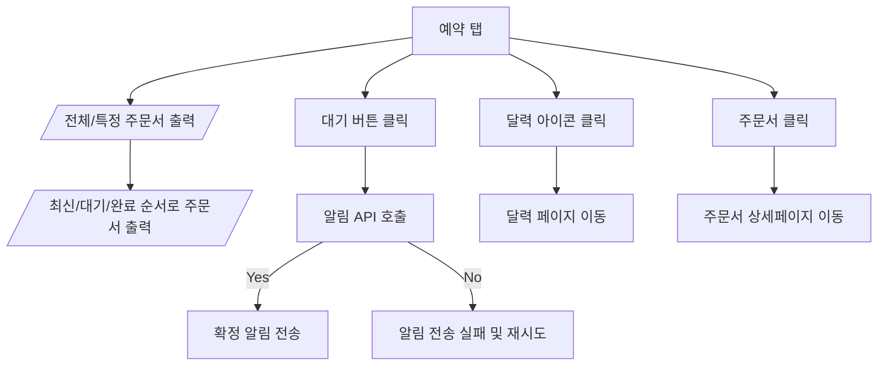

**기능**

1. 예약 리스트 확인
    - `사업자`는 전체 / 특정 주문서 리스트를 확인할 수 있다.
        - `사업자` 전체/대기/완료 필터를 적용하여 원하는 순서의 리스트를 확인할 수 있다.
    - `사업자` 캘린더 UI를 통해서 해당 날짜에 확정된 예약 주문서를 확인할 수 있다.
2. 알림 전송
    - `사업자`는 대기 주문서를 확정할 경우 알림을 통해 `고객`에게 알릴 수 있다.

**사용자 액션**

1. 주문서 리스트 출력
    - 전체(/특정) 주문서 출력
    - 전체(/대기/완료) 버튼으로 정렬된 주문서 출력
2. 주문서 대기 버튼 클릭
    - 알림 API 호출
        - 알림 API 호출 성공 시 대기 버튼이 확정 버튼으로 변경
3. 주문서 클릭
    - 주문서 상세 페이지 이동
4. 캘린더 아이콘을 클릭
    - 달력 UI에 예약 표시

---

### **마이페이지 사용자 스토리**

---

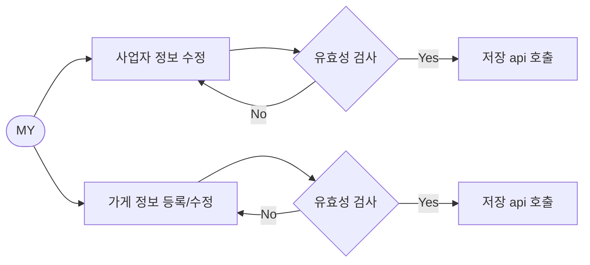

**기능**

1. 사업자 정보 수정
    - `사업자`가 입력한 정보의 변경이 있으면 수정할 수 있습니다.
2. 가게 정보 등록/ 수정
    - `사업자`는 가게 정보를 등록하여 가게 인증을 할 수 있습니다.
    - `사업자`는 가게 정보의 변경이 있으면 수정할 수 있습니다.

**입력 항목**

- 사업자등록번호: 문자열 (10자)
- 가게 상호: 문자열 (최대 50자)
- 성명: 문자열 (최대 10자)
- 개업연월일: date
- 사업장 소재지: 문자열 (최대 100자)
- 사업의 종류:  문자열 (최대 50자)
- 업장명: 문자열 (최대 10자)
- 업장 주소: 문자열 (최대 100자)
- 업장 전화번호: 숫자
- 운영 시간: 문자열 (최대 15자)
- 주차 가능 여부:  radio 버튼 입력
- 추가 설명: 문자열 (최대 100자)
- SNS 계정 링크: 문자열 (최대 2048자)
- 이미지: formData(용량: 2Mb, jpg/jpeg,png로 제한)

**사용자 액션**

- MY 탭 클릭
- 사업자 정보 수정 클릭
- 가게 정보 등록 클릭
    - 정보 입력
- 가게 정보 수정 클릭
    - 정보 수정

---

### 업종 탐색 사용자 스토리

---

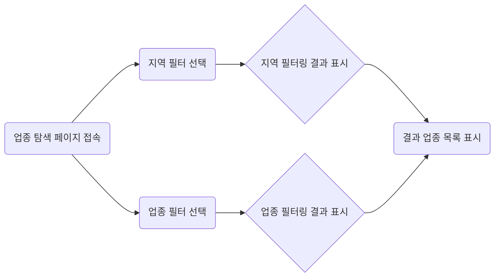

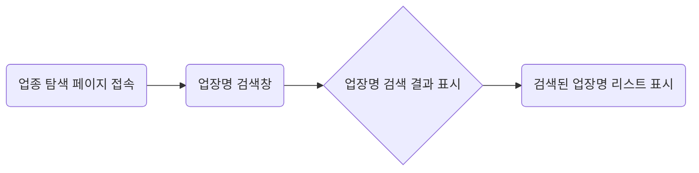

**기능**

1. **필터링 기능 (지역, 업종)**
    - `고객`은 지역(예: 서울, 경기)과 업종(예: 케이크, 꽃)을 선택하여 조건에 맞는 원하는 업종을 탐색할 수 있다.
    - `고객`이 필터를 설정하지 않으면 기본 정렬 조건(평점 순, 거리 순 등)에 따라 자동으로 결과가 표시된다.
2. **검색 기능 (업장명)**
    - `고객`은 특정 업장명을 입력하여 해당 업장을 빠르게 검색할 수 있다.

**입력 항목**

1. **필터**
    - 지역: 드롭다운 선택 (최대 1개 선택 가능)
    - 업종: 드롭다운 선택 (최대 1개 선택 가능)
2. **검색**
    - 업장명: 문자열 (최대 30자)

**사용자 액션**

1. **필터링 버튼 클릭**
    - `고객`이 지역 및 업종 선택 후, 필터링 API 호출
    - API 호출 성공 시 필터링된 업장 목록 표시
2. **검색 버튼 클릭**
    - 업장명 입력 후 검색 API 호출
        - 성공: 업장 목록에서 해당 업장만 표시
        - 실패: 오류 메시지(예: 검색 결과가 없습니다.) 제공

---

### 주문서 작성 사용자 스토리

---

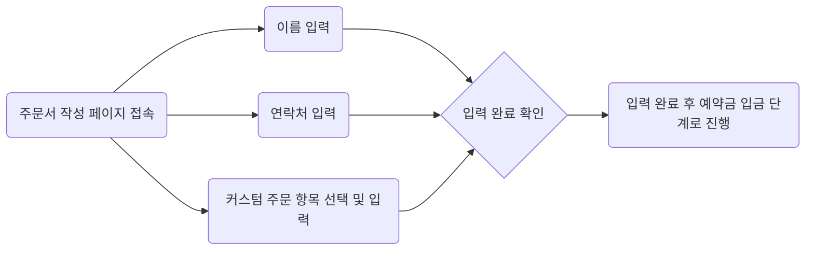

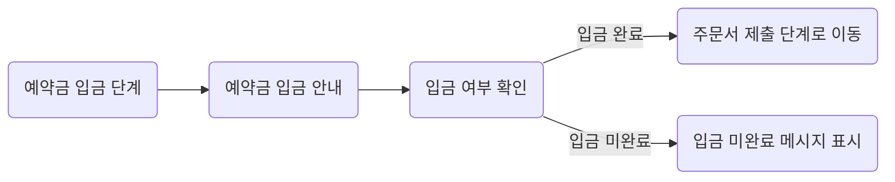

**기능**

1. **사용자 정보 입력과 주문 항목 커스터마이징**
   - `고객`은 이름, 연락처와 함께 주문 항목에 대한 맞춤 정보를 기입할 수 있다.
   - 주문 항목
     - 픽업 날짜 및 시간 선택
     - 요청 사항 입력(텍스트).
     - 옵션 선택(체크박스/라디오버튼/드롭다운 등)
2. **유효성 검사**
   - 주문 항목에 대한 유효성 검사
     - 날짜 형식 확인(YYYY-MM-DD)
     - 요청 사항 글자 수 제한(최대 500자)
     - 옵션이 반드시 선택되어야 하는 경우 확인

**입력 항목**

1. 이름: 문자열 (최대 50자)
2. 연락처: 문자열 (숫자 형식, 최대 15자)
3. 픽업 날짜: 문자열 (YYYY-MM-DD)
   - 요청 사항: 텍스트(최대 500자)
4. 추가 옵션

- 텍스트/라디오 버튼/체크박스/드롭다운/이미지 삽입 등의 형태.

1. 결제 수단 선택: 라디오 버튼 형태로 제공.
2. 입금 확인 버튼: 결제 완료 후 `고객`이 클릭하여 프로세스 종료.

**사용자 액션**

1. **이름 및 연락처 기입**
   - `고객`은 이름과 연락처 입력하고 확인 버튼 클릭
     - 유효성 검사 통과 시 다음 단계 진행, 실패 시 오류 메시지 표시.
2. **커스텀 주문 항목 입력**
   - 픽업 날짜: 달력 위젯 또는 텍스트 입력
   - 요청 사항: 텍스트 입력 창 제공.
   - 옵션 선택: 텍스트/라디오 버튼/체크박스/드롭다운/이미지 삽입 등의 형태
   - 유효성 검사 실패 시 오류 메시지 제공.
3. **예약금 입금**
   - **결제 수단 선택**
     - `고객`이 무통장, 네이버페이, 토스페이 중 하나를 선택.
     - 선택된 결제 수단에 따라 해당 결제 프로세스 진행
       - **무통장:** 입금 계좌 정보 제공.
       - **네이버페이, 토스페이:** 해당 결제 창으로 리다이렉트 또는 팝업 실행
   - **결제 완료 후 확인**
     - 결제가 완료되면 "입금 확인" 버튼 클릭
     - 예약금 확인 API 호출.
   - **API 결과 처리**
     - 성공: 주문서 제출 API 호출 후 완료(예: 주문이 성공적으로 제출되었습니다.) 메시지 표시
     - 실패: 결제 실패 메시지(예: 입금 확인이 이루어지지 않았습니다.) 제공

---

### 주문에 대한 대기/확정 알림 사용자 스토리

---

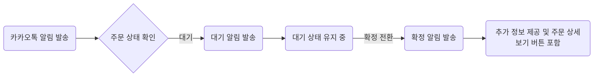

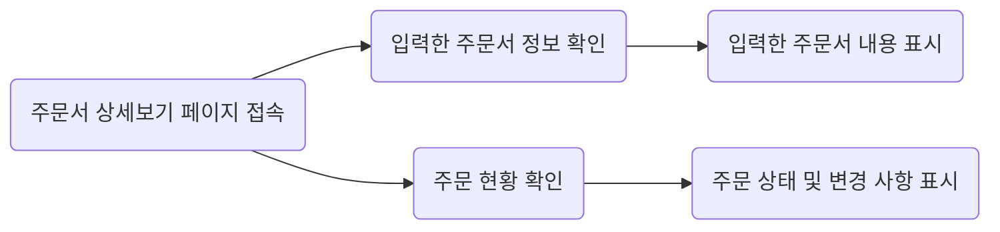

**기능**

1. **주문 상태 실시간 확인**
    - `고객`은 카카오톡 알림 메시지를 통해 주문 상태(예: 대기, 확정 등)를 확인할 수 있다.
    - 주문 번호와 상태, 상세 정보를 알림 메시지에서 바로 확인 가능하다.
2. **알림 메시지 내 버튼 링크 제공**
    - "주문 상세보기" 버튼 클릭 시, `고객`은 별도의 입력 없이 주문 상세 페이지로 연결된다.

3 . **상태 변경 안내**

- 대기 상태에서 확정 상태로 변경될 경우, `고객`에게 카카오톡 알림 메시지로 안내한다.

**사용자 액션**

1. **대기 상태 알림 수신**
    - 주문이 대기 상태일 경우, 서버는 해당 `고객`의 휴대폰 번호로 카카오톡 알림 메시지를 전송
    - 알림 메시지에는 아래 정보 포함
        - 주문 번호
        - 주문 요약
        - 현재 상태: 대기 중
        - `주문 상세보기` 버튼
2. **확정 상태 알림 수신**
    - 대기 상태에서 확정 상태로 전환 시, 서버에서 카카오톡 알림 메시지를 추가로 발송
    - 알림 메시지에는 아래 정보 포함
        - 주문 번호
        - 주문 요약
        - 현재 상태: "확정"
        - 확정 후 진행 상황에 대한 추가 정보
        - `주문 상세보기` 버튼
3. **주문 상세 페이지 확인**
    - `고객`이 카카오톡 알림의 "주문 상세보기" 버튼을 클릭
    - 주문 상세 페이지에서 입력된 주문 정보와 대기 → 확정 상태 변경 내역을 확인

### 주문에 대한 취소 사용자 스토리

---

### 사장님이 주문을 취소하는 경우

---

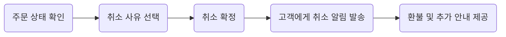
**기능**

1. **주문 취소 상태 변경**
    - `사장님`은 예약 관리 상세 페이지에서 주문 상태를 `취소`로 변경 가능
    - 취소 시, `고객`에게 자동으로 카카오톡 알림 발송
2. **취소 사유 선택**
    - `사장님`은 취소 사유를 선택하거나 추가 입력 가능
    - 사유 목록에는 "재료 부족", "운영 중단", "기타 사유" 등이 포함
3. **고객 알림 발송**
    - `고객`에게 카카오톡 알림으로 주문 취소 안내 발송
    - 알림에는 취소 사유, 환불 정책, 연락처 등이 포함
4. **환불 절차 안내**
    - 환불 가능 여부와 절차 안내 제공
    - 즉시 환불이 불가능한 경우 예상 처리 기간 표시

**사용자 액션** 

1. **주문 관리 페이지 접속**
    - `사장님`은 예약 관리 페이지에서 특정 주문서를 선택
2. **취소 사유 선택 및 입력**
    - 제공된 취소 사유 중 하나를 선택
    - 기타 사유를 선택한 경우, 구체적인 내용을 추가로 입력
3. **취소 요청 완료**
    - 취소 사유 입력 후 "취소 확정" 버튼 클릭
    - `고객`에게 자동으로 카카오톡 알림 발송

---

### 고객이 주문을 취소하는 경우
---

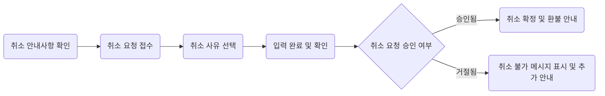

**기능**

1. **취소 요청 접수**
    - `고객`이 업장의 취소 안내사항을 확인하고, 취소 요청 가능
2. **취소 사유 선택 및 입력 지원**
    - 사유를 선택하는 드롭다운 메뉴 제공
    - 기타 사유를 선택한 경우 추가 입력란 표시
3. **취소 요청 검토**
    - 업장이 `고객`의 요청을 검토하고 승인 또는 거절 여부를 결정
    - 승인 여부는 카카오톡 알림을 통해 실시간으로 전달
4. **취소 요청 결과 알림**
    - 취소 요청 접수 후, `고객`이 요청 결과를 실시간으로 확인할 수 있도록 카카오톡 알림 제공
        - **승인된 경우**: 취소 확정 메시지와 함께 환불 정책 및 절차 안내
        - **거절된 경우**: 취소 불가 사유와 추가 안내 제공

**사용자 액션**

1. **취소 안내사항 확인**
    - `고객`은 취소 요청을 하기 전에 업장에서 제공하는 취소 정책(예: 환불 규정, 요청 가능 기한 등)을 확인
    - 확인 후, 취소 요청 버튼을 클릭
2. **취소 요청 및 사유 접수**
    - `고객`은 카카오톡 알림의 주문서 상세보기 내에서 `취소 버튼`을 통해 취소 요청
    - `고객`은 업장에서 제공한 사유 목록(예: 일정 변경, 단순 변심, 기타 등) 중 적합한 옵션을 선택
3. **입력 완료 및 확인**
    - 선택한 사유를 확인한 뒤, 제출 버튼을 클릭
    - 제출 완료 후, "취소 요청이 접수되었습니다."라는 확인 메시지 표시
4. **취소 요청 승인 여부 (요청 결과) 확인**
    - 요청이 접수되면 업장에서 검토 후 승인 또는 거절 결과를 사용자에게 알림
    - **승인된 경우**
        - "취소 요청이 승인되었습니다."라는 메시지와 함께 환불 절차 안내 제공
    - **거절된 경우**
        - "취소 요청이 거절되었습니다."라는 메시지와 함께 이유 및 추가 안내 제공(예: 연락처)