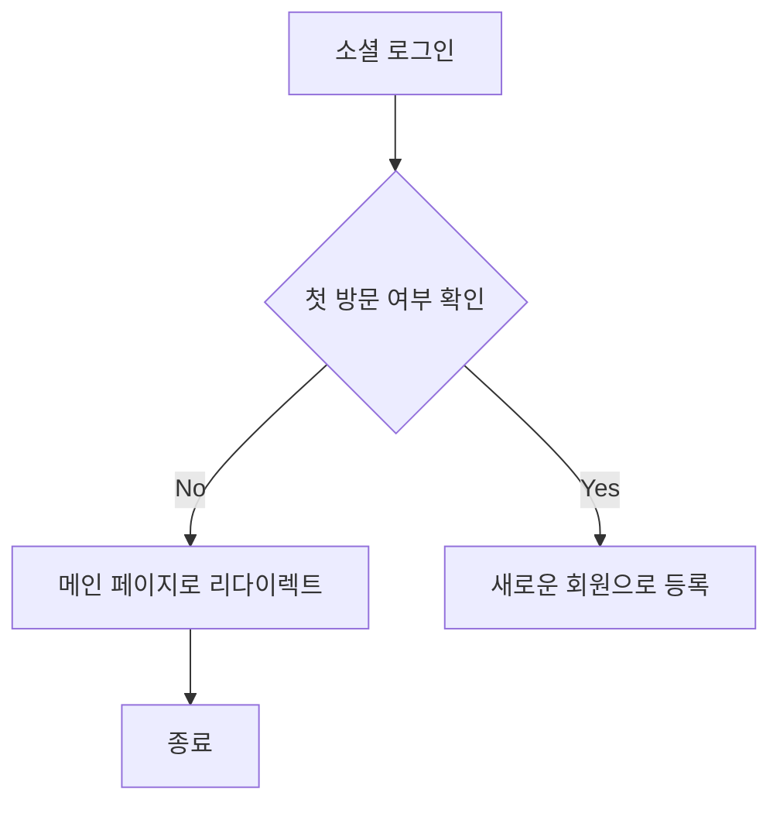
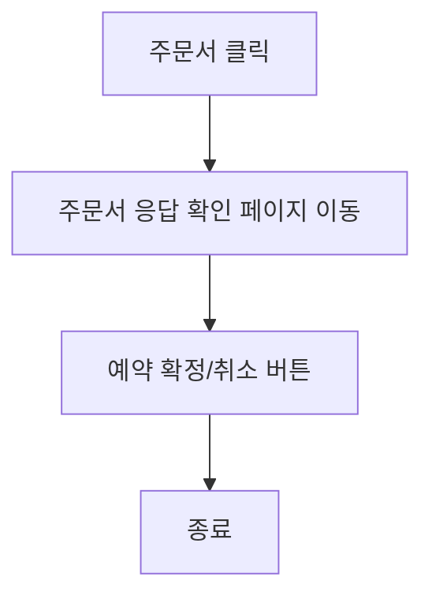
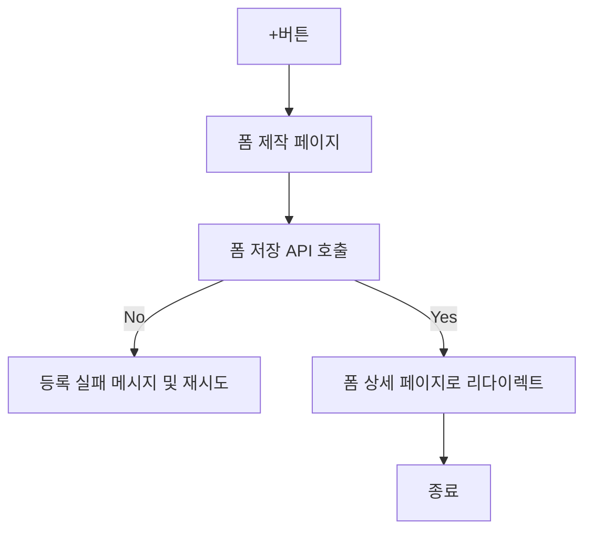
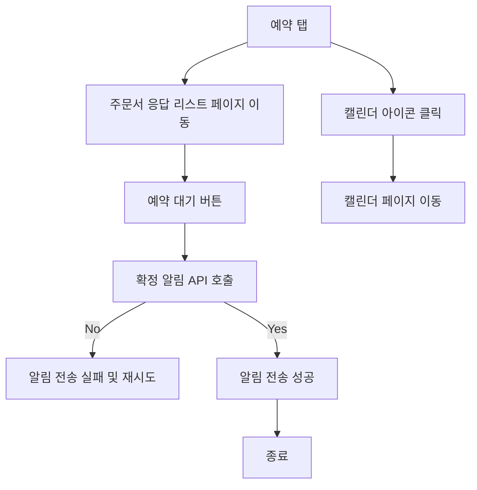
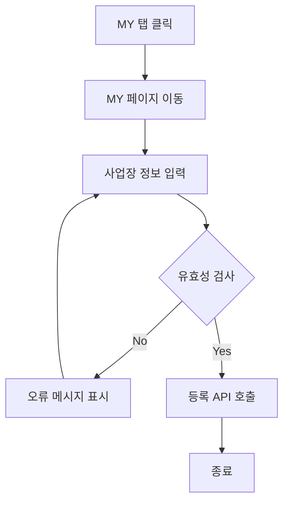

# 기능 정의서

## 사장님

#### 1. 기능명: 소셜 로그인/회원가입

* 기능 설명
  * 소셜 로그인을 통해 사용자가 쉽게 웹/앱에 등록할 수 있도록 하며, 사용자의 정보를 등록할 수 있습니다.

##### 1.1 사용자 액션

* 소셜 로그인
  * 소셜 로그인 클릭 시 첫 방문일 경우 회원가입으로 전환

---
#### 2. 기능명: 주문서 확인
* 기능 설명
  * 고객이 사용자의 주문서 폼의 응답을 확인 후 예약 확정/취소로 고객과 계약을 확정할 수 있습니다.

##### 2.1 사용자 액션
* 메인 홈 주문서 클릭
* 주문서 응답 확인 페이지로 이동
* 예약 확정/취소 버튼 클릭

---
#### 3. 기능명: 주문서 제작(생성) 
* 기능 설명
  * 사용자 중심 설계로 자유로운 형태의 주문서를 만들 수 있는 기능을 제공합니다.

* 입력 항목
  * 주문서 제목: 문자열, 최대 50자
  * 주문서 설명: 문자열, 쵀대 255자

* 제작 페이지 제공 옵션
  * text: 단답형의 짧은 답할 수 있음
  * textarea: 장문형의 긴 답할 수 있음
  * radio: 보기 옵션 중 한 가지 옵션만 답할 수 있음
  * checkbox: 보기 옵션의 복수 선택을 할 수 있음, 최대 선택 수와 최소 선택 수를 설정할 수 있음
  * formData: 원하는 도안의 파일을 받을 수 있음 (용량: 2Mb, jpg/jpeg,png로 제한)
  * date: 날짜와 시간을 선택할 수 있음
   
##### 3.1 사용자 액션
* 메인 홈 +버튼 클릭 
* 주문서 폼 제작 페이지 이동
  * 주문서 작성 후 등록 API 호출
  * API 호출 성공 시 주문서 폼 상세 페이지 이동

---
#### 4. 기능명: 예약 확인
* 기능 설명
  * 예약이 성사된 주문서를 최신순으로 보여줍니다. 사용자는 필터기능과 검색기능을 통해 필요에 맞는 리스트를 확인 할 수 있습니다. 사용자가 한눈에 일정과 데이터를 시작적으로 전달할 수 있는 캘린더 기능을 제공합니다.

##### 4.1 사용자 액션
* 예약 탭 버튼을 클릭
* 주문서의 응답이 최신순의 리스트로 출력
  * 대기 버튼 클릭
  * 확정 알림 API 호출
  * 알림 API 호출 성공 시 대기 버튼이 확인 버튼으로 변경
* 캘린더 아이콘을 클릭
  * 확정된 예약 확인가능

---
#### 5. 기능명: 마이페이지
* 기능 설명
  * 사용자의 가게 정보를 등록 / 수정 할 수 있습니다.
* 입력 항목
  * 가게 ID: 고유 식별자 (자동 생성)
  * 가게 상호: 문자열, 최대 50자
  * 사업자등록번호: 숫자
  * 주소: 문자열, 최대 100자
  * 대표자명: 문자열, 최대 10자
  * 연락처: 숫자
  * 상당 링크: 문자열, 최대 2048자
  * 이미지: formData(용량: 2Mb, jpg/jpeg,png로 제한)

##### 5.1 사용자 액션
* MY 탭 클릭
* 사업장 정보 입력

