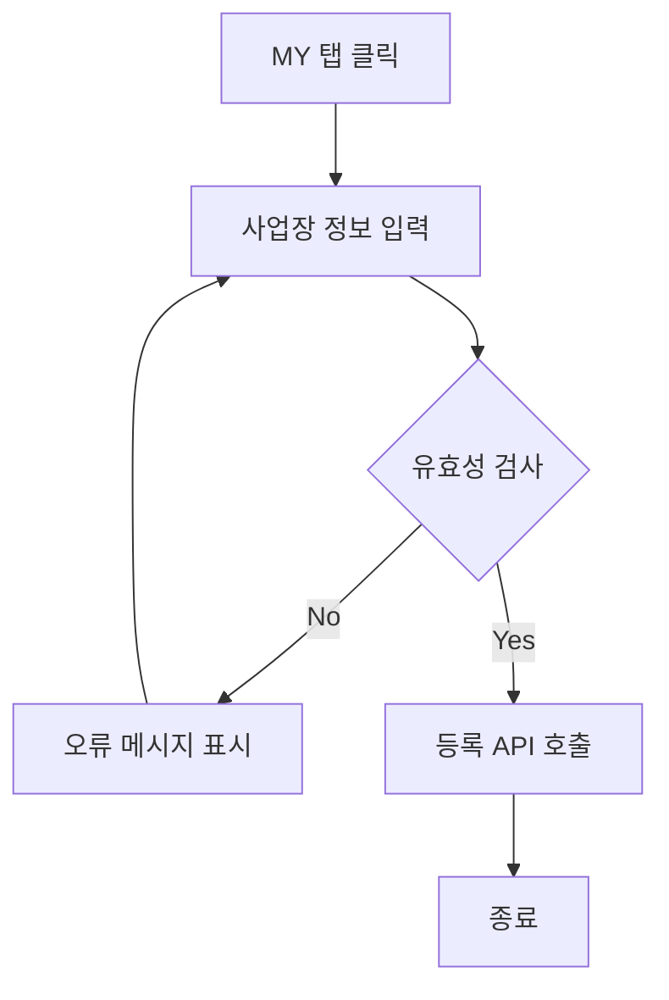

# 기능 정의서

## 사장님

#### 1. 기능명: 소셜 로그인/회원가입

* 기능 설명
  * 소셜 로그인을 통해 사용자가 쉽게 웹/앱에 등록할 수 있도록 하며, 사용자의 정보를 등록할 수 있습니다.

##### 1.1 사용자 액션

* 소셜 로그인
  * 소셜 로그인 클릭 시 첫 방문일 경우 회원가입으로 전환


---
<<<<<<< HEAD
### 소셜 로그인/회원가입 
---
```mermaid
flowchart TD;
  A([소셜 로그인])-->B{기존 회원 확인};
  B-->|Yes|C[메인 페이지로 이동]-->D([종료]);
  B-->|No|E[MY 페이지 이동];
  ```

**기능**
1. **소셜 로그인 기능**
  - `사업자`는 서비스를 이용하기 위해 간편 소셜 로그인을 통해 서비스에 가입/이용할 수 있다. 

**사용자 액션**

1. **소셜 로그인 버튼 클릭**
   - 기존 `사업자`는 메인 페이지로 리다이렉트
   - 신규 `사업자`는 사업장 정보를 입력할 수 있는 MY 페이지로 리다이렉트

---
### 주문서 확인 사용자 스토리

---

```mermaid
flowchart TD;
A([홈 페이지]) -->B[나의 폼 ]
B --> B1{주문서 존재 유무 }
B1 -->|Yes|B1a[/링크 출력 /]

B1 -->|No|B1b[/메시지 출력 /]

A -->C[나의 주문서 ]
C -->C1[주문서 생성 선택 ]
C1 -->C1a[주문서 생성 페이지 이동 ]
C1a -->C1b[/주문서 제목, 주문서 설명 입력, 주문서 옵션 선택 /] --> CA{유효성 검사}
CA -->|Yes| C1c[주문서 상세 페이지 이동 ]
CA -->|No| C1a
C -->C2[주문서 선택 ]
C2 -->C2a[예약 페이지 이동 ]
C2a -->C2b[/주문서 리스트 출력/]

A -->D[에약관리 ]
D -->D1[예약대기/예약확정 클릭 ]
D1 -->D1a[예약 페이지 이동 ]
D1a -->D1b[/예약대기/예약확정 출력/]
```

**기능**
1. **나의 폼**
   - `사업자`는 주문서 폼이 존재한다면 나의 주문서 리스트를 확인 할 수 있는 링크를 생성할 수 있다.
2. **나의 주문서**
   - `사업자`는 주문서 폼을 새롭게 생성할 수 있다.
   - `사업자`는 생성된 주문서 폼 리스트를 확인 할 수 있다.
3. **예약관리**
   - `사업자`는 예약대기 전체를 파악할 수 있다.
   - `사업자`는 에약화정 전체/일일 예약확정 수를 파악할 수 있다.

**입력 항목**
  * 주문서 제목: 문자열, 최대 50자
  * 주문서 설명: 문자열, 쵀대 255자

**제작 페이지 제공 옵션**
  * text: 단답형의 짧은 답할 수 있음
  * textarea: 장문형의 긴 답할 수 있음
  * radio: 보기 옵션 중 한 가지 옵션만 답할 수 있음
  * checkbox: 보기 옵션의 복수 선택을 할 수 있음, 최대 선택 수와 최소 선택 수를 설정할 수 있음
  * formData: 원하는 도안의 파일을 받을 수 있음 (용량: 2Mb, jpg/jpeg,png로 제한)
  * date: 날짜와 시간을 선택할 수 있음

**사용자 액션**
* 홈 탭 클릭
* 주문서 클릭
* 주문서 응답 확인 페이지로 이동
* 예약 확정/취소 버튼 클릭
1. **나의 폼**
   - 주문서 폼이 생성되어 있다면 나의 폼에서 링크 표시.
     - 링크를 복사하여 이용할 수 있음
   - 주문서 폼이 생성되어 있지 않다면 링크 표시 되지 않음
     - "주문서를 먼저 생성해 주세요!" 메시지 출력
2. **나의 주문서**
   - 주문서 생성 버튼 클릭
     - 주문서 폼 생성 페이지로 이동
   - 주문서 클릭
     - 관련 주문서 리스트 출력 
3. **예약관리**
   - 예약대기/예약확정 클릭
     - 예약 페이지로 이동
       - 대기/예약확정 순서로된 리스트 출력
---

### 예약확인 사용자 스토리
---


**기능** 
1. **예약 리스트 확인**
   - `사업자`는 전체 / 특정 주문서에 관련된 응답 리스트만을 확인할 수 있다.
     - `사업자` 전체/대기/완료 필터를 적용하여 원하는 순서의 리스트를 확인할 수 있다.
   - `사업자` 캘린더 UI를 통해서 해당 날짜에 확정된 예약 주문서를 확인할 수 있다.
2. **알림 전송**
   - `사업자`는 대기 주문서를 확정할 경우 알림을 통해 `고객`에게 알릴 수 있다.

**사용자 액션**
 - 예약 탭 클릭
 - 전체 주문서가 최신순으로 리스트 출력
   - 특정 주문서 선택
     - 특정 주문서 출력
 - 전체/대기/완료 버튼으로 순서 재정렬
 - 주문서의 대기 버튼 클릭
   - 알림 API 호출
   - 알림 API 호출 성공 시 대기 버튼이 확인 버튼으로 변경
 - 주문서 클릭
   - 주문서 상세 페이지 이동
 - 캘린더 아이콘을 클릭
   - 확정된 예약 확인가능

---

### 마이페이지 사용자 스토리
---

**기능** 
  1. **가게 정보를 등록**
     - `사업자`는 가게 정보를 등록하여 가게 인증을 할 수 있습니다.
  2. **수정**
     - `사업자`는 가게 정보의 변경이 있으면 정보를 수정할 수 있습니다.
**입력 항목**
  * 가게 ID: 고유 식별자 (자동 생성)
  * 가게 상호: 문자열, 최대 50자
  * 사업자등록번호: 문자열: 최대 15자
  * 주소: 문자열, 최대 100자
  * 대표자명: 문자열, 최대 10자
  * 연락처: 숫자
  * 상당 링크: 문자열, 최대 2048자
  * 이미지: formData(용량: 2Mb, jpg/jpeg,png로 제한)

**사용자 액션**
 - MY 탭 클릭
 - 사업장 정보 입력
 - 사업장 정보 수정

---
### 전체 업종 탐색 사용자 스토리
=======
#### 2. 기능명: 주문서 확인
* 기능 설명
  * 고객이 사용자의 주문서 폼의 응답을 확인 후 예약 확정/취소로 고객과 계약을 확정할 수 있습니다.

##### 2.1 사용자 액션
* 메인 홈 주문서 클릭
* 주문서 응답 확인 페이지로 이동
* 예약 확정/취소 버튼 클릭


>>>>>>> b82192ba97a5f48413873744bedcdb6383532ba9

---
#### 3. 기능명: 주문서 제작(생성) 
* 기능 설명
  * 사용자 중심 설계로 자유로운 형태의 주문서를 만들 수 있는 기능을 제공합니다.

* 입력 항목
  * 주문서 제목: 문자열, 최대 50자
  * 주문서 설명: 문자열, 쵀대 255자

* 제작 페이지 제공 옵션
  * text: 단답형의 짧은 답할 수 있음
  * textarea: 장문형의 긴 답할 수 있음
  * radio: 보기 옵션 중 한 가지 옵션만 답할 수 있음
  * checkbox: 보기 옵션의 복수 선택을 할 수 있음, 최대 선택 수와 최소 선택 수를 설정할 수 있음
  * formData: 원하는 도안의 파일을 받을 수 있음 (용량: 2Mb, jpg/jpeg,png로 제한)
  * date: 날짜와 시간을 선택할 수 있음
   
##### 3.1 사용자 액션
* 메인 홈 +버튼 클릭 
* 주문서 폼 제작 페이지 이동
  * 주문서 작성 후 등록 API 호출
  * API 호출 성공 시 주문서 폼 상세 페이지 이동


---
#### 4. 기능명: 예약 확인
* 기능 설명
  * 예약이 성사된 주문서를 최신순으로 보여줍니다. 사용자는 필터기능과 검색기능을 통해 필요에 맞는 리스트를 확인 할 수 있습니다. 사용자가 한눈에 일정과 데이터를 시작적으로 전달할 수 있는 캘린더 기능을 제공합니다.

##### 4.1 사용자 액션
* 예약 탭 버튼을 클릭
* 주문서의 응답이 최신순의 리스트로 출력
  * 대기 버튼 클릭
  * 확정 알림 API 호출
  * 알림 API 호출 성공 시 대기 버튼이 확인 버튼으로 변경
* 캘린더 아이콘을 클릭
  * 확정된 예약 확인가능


---
#### 5. 기능명: 마이페이지
* 기능 설명
  * 사용자의 가게 정보를 등록 / 수정 할 수 있습니다.
* 입력 항목
  * 가게 ID: 고유 식별자 (자동 생성)
  * 가게 상호: 문자열, 최대 50자
  * 사업자등록번호: 숫자
  * 주소: 문자열, 최대 100자
  * 대표자명: 문자열, 최대 10자
  * 연락처: 숫자
  * 상당 링크: 문자열, 최대 2048자
  * 이미지: formData(용량: 2Mb, jpg/jpeg,png로 제한)

##### 5.1 사용자 액션
* MY 탭 클릭
* 사업장 정보 입력


