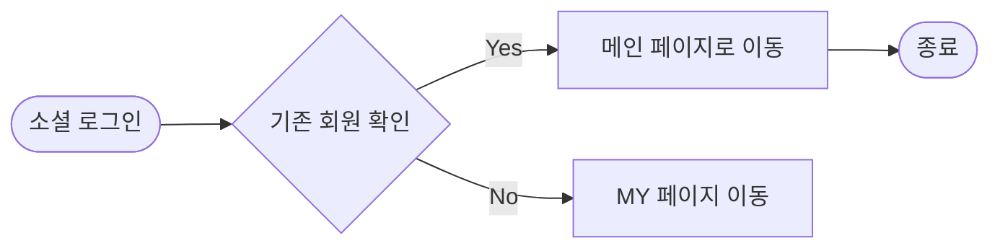
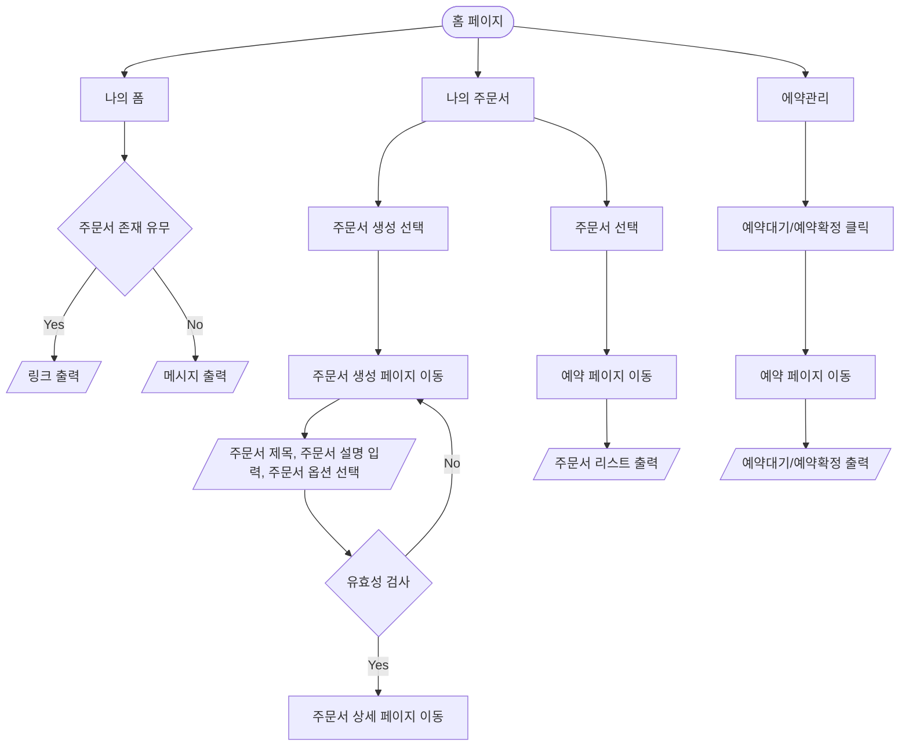
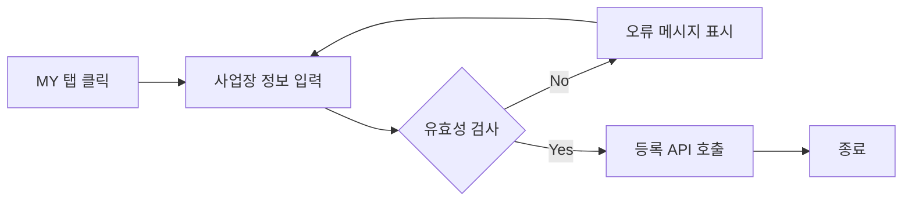

**기능 정의서:** 프로젝트 정의서의 사용자 스토리를 기반으로 세부 기능을 구체적으로 정의합니다.

---

### **🖥️ 페이지**

1. **사장님**
   - 소셜 로그인/회원가입 페이지
     - 소셜 로그인 (카카오) 버튼
   - 주문서 제작(생성) 페이지
     - 커스텀 가능
       - 텍스트, 체크박스, 라디오 버튼, 이미지 등 자유롭게 제작
       - 보관법/가격/재고 안내 등 추가 기입
   - 마이페이지
     - 사업장 정보 수정 버튼
       - 사업자 등록 번호 수정
       - 인증 절차
     - 내가 등록한 업종 정보(가게명, 주소, 연락처 등) 수정/삭제 버튼
   - 메인 페이지
     - 사업자/업장 등록 버튼
     - 링크 확인/복사
     - 내가 생성한 나의 주문서(폼)
     - 예약 현황
       - 대기/확정
   - 예약 페이지
     - (기본) 리스트
       - 필터링 (대기/확정)
       - 개별 주문서 확인 가능
     - (추가) 달력
2. **소비자**
   1. 전체 업종 탐색 페이지
      1. 필터링 기능 (지역, 업종)
      2. 검색 기능 (업장명)
   2. 주문서 작성
      1. 이름, 연락처 필수 기입
      2. 예약금 입금
   3. 주문에 대한 대기/확정 알림
      1. 취소/환불에 관한 안내사항 함께
      2. 주문서 상세보기를 통해 입력한 주문서, 주문 현황 등 확인 가능
   4. 주문에 대한 취소 알림
      1. 취소/환불에 관한 안내사항 함께
      2. 주문서 상세보기를 통해 입력한 주문서, 주문 현황 등 확인 가능

---

### 로그인/회원가입 사용자 스토리

---

**기능**

1. **소셜 로그인 기능**

- `사업자`는 서비스를 이용하기 위해 간편 소셜 로그인을 통해 서비스에 가입/이용할 수 있다.

**사용자 액션**

- 소셜 로그인 버튼 클릭
  - 기존 `사업자`는 메인 페이지로 리다이렉트
  - 신규 `사업자`는 사업장 정보를 입력할 수 있는 MY 페이지로 리다이렉트

### 메인 페이지 사용자 스토리

---

**기능**

1. 나의 폼
   - `사업자`는 주문서 폼이 존재한다면 나의 주문서 리스트를 확인 할 수 있는 링크를 생성할 수 있다.
2. 나의 주문서
   - `사업자`는 주문서 폼을 새롭게 생성할 수 있다.
   - `사업자`는 생성된 주문서 폼 리스트를 확인 할 수 있다.
3. 예약관리
   - `사업자`는 예약대기 전체를 파악할 수 있다.
   - `사업자`는 에약화정 전체/일일 예약확정 수를 파악할 수 있다.

**입력 항목**

- 주문서 제목: 문자열, 최대 50자
- 주문서 설명: 문자열, 쵀대 255자

**제작 페이지 제공 옵션**

- `text`: 단답형의 짧은 답할 수 있음
- `textarea`: 장문형의 긴 답할 수 있음
- `radio`: 보기 옵션 중 한 가지 옵션만 답할 수 있음
- `checkbox`: 보기 옵션의 복수 선택을 할 수 있음, 최대 선택 수와 최소 선택 수를 설정할 수 있음
- `formData`: 원하는 도안의 파일을 받을 수 있음 (용량: 2Mb, jpg/jpeg,png로 제한)
- `date`: 날짜와 시간을 선택할 수 있음

**사용자 액션**

- 홈 탭 클릭
- 주문서 클릭
  - 주문서 응답 확인 페이지로 이동
- 예약 확정/취소 버튼 클릭

1. 나의 폼
   - 주문서 폼이 생성되어 있다면 나의 폼에서 링크 표시.
     - 링크를 복사하여 이용할 수 있음
   - 주문서 폼이 생성되어 있지 않다면 링크 표시 되지 않음
     - "주문서를 먼저 생성해 주세요!" 메시지 출력
2. 나의 주문서
   - 주문서 생성 버튼 클릭
     - 주문서 폼 생성 페이지로 이동
   - 주문서 클릭
     - 관련 주문서 리스트 출력
3. 예약 관리
   - 예약대기/예약확정 클릭
     - 예약 페이지로 이동
       - 대기/예약확정 순서로된 리스트 출력

### **예약 확인 사용자 스토리**

---

**기능 설명**

1. 예약 리스트 확인
   - `사업자`는 전체 / 특정 주문서에 관련된 응답 리스트만을 확인할 수 있다.
     - `사업자` 전체/대기/완료 필터를 적용하여 원하는 순서의 리스트를 확인할 수 있다.
   - `사업자` 캘린더 UI를 통해서 해당 날짜에 확정된 예약 주문서를 확인할 수 있다.
2. 알림 전송
   - `사업자`는 대기 주문서를 확정할 경우 알림을 통해 `고객`에게 알릴 수 있다.

**사용자 액션**

1. 예약 탭 클릭
   - 전체 주문서가 최신순으로 리스트 출력
     - 특정 주문서 선택
     - 특정 주문서 출력
   - 전체/대기/완료 버튼으로 순서 재정렬
2. 주문서의 대기 버튼 클릭
   - 알림 API 호출
   - 알림 API 호출 성공 시 대기 버튼이 확인 버튼으로 변경
3. 주문서 클릭
   - 주문서 상세 페이지 이동
4. 캘린더 아이콘을 클릭
   - 확정된 예약 확인가능

### **마이페이지 사용자 스토리**

---

**기능 설명**

1. 가게 정보 등록
   - `사업자`는 가게 정보를 등록하여 가게 인증을 할 수 있습니다.
2. 가게 정보 수정
   - `사업자`는 가게 정보의 변경이 있으면 정보를 수정할 수 있습니다.

**입력 항목**

- 가게 ID: 고유 식별자 (자동 생성)
- 가게 상호: 문자열, 최대 50자
- 사업자등록번호: 문자열: 최대 15자
- 주소: 문자열, 최대 100자
- 대표자명: 문자열, 최대 10자
- 연락처: 숫자
- 상당 링크: 문자열, 최대 2048자
- 이미지: formData(용량: 2Mb, jpg/jpeg,png로 제한)

**사용자 액션**

- MY 탭 클릭
- 사업장 정보 입력
- 사업장 정보 수정

### 전체 업종 탐색 사용자 스토리

---

**기능**

1. **필터링 기능 (지역, 업종)**
   - `고객`은 지역(예: 서울, 경기)과 업종(예: 케이크, 꽃)을 선택하여 조건에 맞는 원하는 업종을 탐색할 수 있다.
   - `고객`이 필터를 설정하지 않으면 기본 정렬 조건(평점 순, 거리 순 등)에 따라 자동으로 결과가 표시된다.
2. **검색 기능 (업장명)**
   - `고객`은 특정 업장명을 입력하여 해당 업장을 빠르게 검색할 수 있다.

**입력 항목**

1. **필터**
   - 지역: 드롭다운 선택 (최대 1개 선택 가능)
   - 업종: 드롭다운 선택 (최대 1개 선택 가능)
2. **검색**
   - 업장명: 문자열 입력 (최대 30자)

**사용자 액션**

1. **필터링 버튼 클릭**
   - `고객`이 지역 및 업종 선택 후, 필터링 API 호출.
   - API 호출 성공 시 필터링된 업장 목록 표시.
2. **검색 버튼 클릭**
   - 업장명 입력 후 검색 API 호출.
     - 성공: 업장 목록에서 해당 업장만 표시.
     - 실패: 오류 메시지(예: 검색 결과가 없습니다.) 제공

### 주문서 작성 사용자 스토리

---

**기능**

1. **사용자 정보 입력과 주문 항목 커스터마이징**
   - `고객`은 이름, 연락처와 함께 주문 항목에 대한 맞춤 정보를 기입할 수 있다.
   - 주문 항목
     - 픽업 날짜 및 시간 선택
     - 요청 사항 입력(텍스트).
     - 옵션 선택(체크박스/라디오버튼/드롭다운 등)
2. **유효성 검사**
   - 주문 항목에 대한 유효성 검사
     - 날짜 형식 확인(YYYY-MM-DD)
     - 요청 사항 글자 수 제한(최대 500자)
     - 옵션이 반드시 선택되어야 하는 경우 확인

**입력 항목**

1. 이름: 문자열 (최대 50자)
2. 연락처: 문자열 (숫자 형식, 최대 15자)
3. 픽업 날짜: 문자열 (YYYY-MM-DD)
   - 요청 사항: 텍스트(최대 500자)
4. 추가 옵션

- 텍스트/라디오 버튼/체크박스/드롭다운/이미지 삽입 등의 형태.

1. 결제 수단 선택: 라디오 버튼 형태로 제공.
2. 입금 확인 버튼: 결제 완료 후 `고객`이 클릭하여 프로세스 종료.

**사용자 액션**

1. **이름 및 연락처 기입**
   - `고객`은 이름과 연락처 입력하고 확인 버튼 클릭
     - 유효성 검사 통과 시 다음 단계 진행, 실패 시 오류 메시지 표시.
2. **커스텀 주문 항목 입력**
   - 픽업 날짜: 달력 위젯 또는 텍스트 입력
   - 요청 사항: 텍스트 입력 창 제공.
   - 옵션 선택: 텍스트/라디오 버튼/체크박스/드롭다운/이미지 삽입 등의 형태
   - 유효성 검사 실패 시 오류 메시지 제공.
3. **예약금 입금**
   - **결제 수단 선택**
     - `고객`이 무통장, 네이버페이, 토스페이 중 하나를 선택.
     - 선택된 결제 수단에 따라 해당 결제 프로세스 진행
       - **무통장:** 입금 계좌 정보 제공.
       - **네이버페이, 토스페이:** 해당 결제 창으로 리다이렉트 또는 팝업 실행
   - **결제 완료 후 확인**
     - 결제가 완료되면 "입금 확인" 버튼 클릭
     - 예약금 확인 API 호출.
   - **API 결과 처리**
     - 성공: 주문서 제출 API 호출 후 완료(예: 주문이 성공적으로 제출되었습니다.) 메시지 표시
     - 실패: 결제 실패 메시지(예: 입금 확인이 이루어지지 않았습니다.) 제공

### 주문에 대한 대기/확정 알림 사용자 스토리

---

**기능**

1. **주문 상태 실시간 확인**
   - `고객`은 카카오톡 알림 메시지를 통해 주문 상태(예: 대기, 확정 등)를 확인할 수 있다.
   - 주문 번호와 상태, 상세 정보를 알림 메시지에서 바로 확인 가능하다.
2. **알림 메시지 내 버튼 링크 제공**
   - "주문 상세보기" 버튼 클릭 시, `고객`은 별도의 입력 없이 주문 상세 페이지로 연결된다.

3 . **상태 변경 안내**

- 대기 상태에서 확정 상태로 변경될 경우, `고객`에게 카카오톡 알림 메시지로 안내한다.

**사용자 액션**

1. **대기 상태 알림 수신**
   - 주문이 대기 상태일 경우, 서버는 해당 `고객`의 휴대폰 번호로 카카오톡 알림 메시지를 전송.
   - 알림 메시지에는 아래 정보 포함:
     - 주문 번호
     - 주문 요약
     - 현재 상태: "대기 중"
     - "주문 상세보기" 버튼
2. **확정 상태 알림 수신**
   - 대기 상태에서 확정 상태로 전환 시, 서버에서 카카오톡 알림 메시지를 추가로 발송.
   - 알림 메시지에는 아래 정보 포함:
     - 주문 번호
     - 주문 요약
     - 현재 상태: "확정"
     - 확정 후 진행 상황에 대한 추가 정보
     - "주문 상세보기" 버튼
3. **주문 상세 페이지 확인**
   - `고객`이 카카오톡 알림의 "주문 상세보기" 버튼을 클릭.
   - 주문 상세 페이지에서 입력된 주문 정보와 대기 → 확정 상태 변경 내역을 확인.

### 주문에 대한 취소 알림 사용자 스토리

---

**기능**

1. **주문 취소 상태 알림**
   - `고객`은 주문이 취소된 경우, 카카오톡 알림 메시지를 통해 주문 상태를 확인할 수 있다.
   - 알림 메시지에는 주문 번호, 취소 사유, 환불 정책 등이 포함된다.
2. **알림 메시지 내 버튼 링크 제공**
   - "주문 상세보기" 버튼 클릭 시, `고객`은 취소된 주문의 상세 정보를 확인할 수 있는 페이지로 연결된다.

**사용자 액션**

1. **카카오톡 알림 수신**
   - 주문이 취소되면 서버에서 해당 `고객`의 휴대폰 번호를 통해 카카오톡 알림 메시지 전송.
   - 알림 메시지에는 아래 정보 포함:
     - 주문 번호
     - 취소 사유
     - 환불 정책 안내
     - "주문 상세보기" 버튼
2. **주문 상세 페이지 확인**
   - `고객`이 알림에서 "주문 상세보기" 버튼을 클릭.
   - 취소된 주문 번호, 취소 사유, 환불 상태(환불 예정 금액, 소요 기간 등)가 표시된 주문 상세 페이지로 연결.
